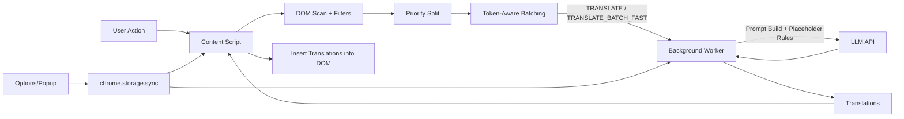
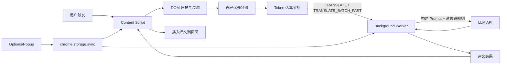

# AI Translator

<p align="center">
  <a href="#english">🇬🇧 English</a> | <a href="#中文">🇨🇳 中文</a>
</p>

---

<a id="english"></a>

## 🌐 AI Translator - Chrome Extension

An AI-powered Chrome browser translation extension that supports selection translation and full-page translation, making web translation smarter and more natural.


### ✨ Features

#### Smart Translation
- **Math Formula Preservation**: Automatically detects and preserves MathJax/KaTeX formulas without translation
- **Code Block Protection**: Code snippets remain untouched during translation
- **Elegant Menu Translation**: Sidebar translations align perfectly with original text (not icons)
- **Custom Prompts**: Customize translation style with your own prompts (formal, casual, technical, etc.)

#### Selection Translation
- Shows a translate button when text is selected
- Click the button to translate (popup or inline based on settings)
- Copy translation with one click
- Translations stay visible until explicitly cleared

#### Hover Translation
- Hover a paragraph and press the hotkey (default: Shift) to translate inline
- Translation appears directly below the paragraph as bilingual text
- Press the hotkey again to restore the original view
- Hotkey is configurable in Settings
- Press `Esc` to clear inline translations, or right-click a paragraph/translation to cancel it

#### Full-Page Translation
- Translate the entire webpage with one click
- Translations appear below original text, preserving layout
- Inherits original styling (font, color, size)
- Toggle show/hide translations
- High-performance batch translation (100 items/batch, 8 concurrent)

#### UI Polish
- Inline translations inherit original typography for a clean, consistent look
- Inline loading indicator is more visible to show translation progress
- Settings controls aligned for consistent spacing and visual hierarchy

#### Float Ball
- Draggable quick action button
- Supports translating selection, page, and toggling translations
- Position auto-saves, persists across page navigation

#### Other Features
- Right-click context menu translation
- Dark/Light theme toggle
- Multi-language support (10+ languages)
- Input text translation dialog

### 🚀 Installation

#### 1. Download

```bash
git clone https://github.com/wangqianqianjun/translator.git
cd translator
```

#### 2. Load in Chrome

1. Open Chrome browser
2. Navigate to `chrome://extensions/`
3. Enable "Developer mode" in the top right
4. Click "Load unpacked"
5. Select the `translator` folder

#### 3. Configure API

1. Click the extension icon in the browser toolbar
2. Click "Settings"
3. Fill in API configuration:
   - **API Endpoint**: e.g., `https://api.openai.com/v1/chat/completions`
   - **API Key**: Your API key
   - **Model Name**: e.g., `gpt-4o-mini`
4. Select target translation language
5. Click "Save Settings"

### 📖 Usage

#### Selection Translation

1. Select text on any webpage
2. Click the "Translate" button that appears
3. View translation in popup or inline (based on settings), click to copy
4. Press `Esc` or click × to close/clear

#### Hover Translation

1. Move the mouse over a paragraph
2. Press the hover hotkey (default: `Shift`)
3. Translation appears below the paragraph
4. Press the hotkey again to restore the original view
5. Press `Esc` to clear inline translations, or right-click a paragraph/translation to cancel it

#### Full-Page Translation

**Method 1: Float Ball**
1. Click the float ball in the bottom-right corner
2. Select "Translate Page"

**Method 2: Extension Menu**
1. Click the extension icon in toolbar
2. Click "Translate Page"

**Method 3: Context Menu**
1. Right-click on the page
2. Select "Translate this page"

#### Show/Hide Translations

After translation:
1. Click the float ball
2. Select "Hide Translations" or "Show Translations"
3. Translations are preserved, no need to re-translate

### ⚙️ Supported APIs

**Works with any OpenAI-compatible API endpoint.** Just configure the endpoint URL, API key, and model name.

| Service | Example API Endpoint | Notes |
|---------|---------------------|-------|
| OpenAI | `https://api.openai.com/v1/chat/completions` | GPT-4o, GPT-4o-mini, etc. |
| **Anthropic Claude** | `https://api.anthropic.com/v1/messages` | Claude Sonnet, Opus, Haiku |
| Azure OpenAI | `https://your-resource.openai.azure.com/...` | |
| Google Gemini | `https://generativelanguage.googleapis.com/v1beta/openai/chat/completions` | Gemini Pro, Flash, etc. |
| DeepSeek | `https://api.deepseek.com/v1/chat/completions` | DeepSeek-V3, etc. |
| OpenRouter | `https://openrouter.ai/api/v1/chat/completions` | Multiple providers |
| Ollama (Local) | `http://localhost:11434/v1/chat/completions` | Local models |
| LM Studio (Local) | `http://localhost:1234/v1/chat/completions` | Local models |

> **Auto-detection**: The extension automatically detects Anthropic Claude API (by domain or `/v1/messages` path) and uses the correct request/response format.

### 🌍 Supported Languages

简体中文 • 繁体中文 • English • 日本語 • 한국어 • Français • Deutsch • Español • Português • Русский

### 📁 Project Structure

```
translator/
├── manifest.json          # Chrome extension configuration
├── background/            # Background script
├── content/               # Content script & styles
├── popup/                 # Popup menu
├── options/               # Settings page
├── i18n/                  # Internationalization
└── icons/                 # Extension icons
```

### 🧱 Technical Architecture

The extension follows a content-first architecture: content scripts collect and batch text, background scripts handle API calls, and UI surfaces manage user settings.

- **Content Script**: scans DOM, filters code/table/math, batches text with token estimation, inserts translations.
- **Background Worker**: builds prompts, calls OpenAI-compatible or Claude APIs, parses errors.
- **Options/Popup UI**: manages API key, model, prompt, theme, and quick actions.
- **Storage**: settings persisted in `chrome.storage.sync`.

### 🔁 Architecture Flowchart



### 📄 License

MIT License

---

<a id="中文"></a>

## 🌐 AI Translator - 智能翻译插件

一款基于 AI 的 Chrome 浏览器翻译插件，支持划词翻译和全文翻译，让网页翻译更智能、更自然。


### ✨ 功能特性

#### 智能翻译
- **数学公式保留**：自动识别并保留 MathJax/KaTeX 数学公式，不会被翻译破坏
- **代码块保护**：代码片段在翻译过程中保持原样不变
- **优雅的菜单翻译**：侧边栏译文与原文精确对齐（而非与图标对齐）
- **自定义 Prompt**：支持自定义翻译风格（正式、口语化、技术文档等）

#### 划词翻译
- 选中文本后显示翻译按钮
- 点击按钮进行翻译（弹窗或段落内显示，可在设置中切换）
- 支持复制译文
- 译文会保留，需手动清除

#### 悬停翻译
- 鼠标悬停段落并按下快捷键（默认：Shift）触发翻译
- 译文显示在段落下方，呈双语形式
- 再次按快捷键可恢复原文
- 快捷键可在设置中自定义
- 按 `Esc` 清除所有段落译文，或右键段落/译文选择取消

#### 全文翻译
- 一键翻译整个网页
- 译文显示在原文下方，保持原网页布局
- 继承原文样式（字体、颜色、大小）
- 支持显示/隐藏译文切换
- 高性能批量翻译（100条/批，8并发）

#### UI 美化
- 译文继承原始排版，整体视觉更统一
- 内嵌加载提示更清晰，便于感知翻译进度
- 设置页控件对齐，层级更清晰

#### 悬浮球
- 可拖动的快捷操作球
- 支持翻译选中文本、翻译页面、显示/隐藏译文
- 位置自动保存，跨页面保持

#### 其他功能
- 右键菜单快速翻译
- 深色/浅色主题切换
- 支持多种目标语言（10+语言）
- 输入文本翻译对话框

### 🚀 安装使用

#### 1. 下载插件

```bash
git clone https://github.com/wangqianqianjun/translator.git
cd translator
```

#### 2. 加载到 Chrome

1. 打开 Chrome 浏览器
2. 地址栏输入 `chrome://extensions/`
3. 开启右上角「开发者模式」
4. 点击「加载已解压的扩展程序」
5. 选择 `translator` 文件夹

#### 3. 配置 API

1. 点击浏览器工具栏中的插件图标
2. 点击「打开设置」
3. 填写 API 配置：
   - **API 地址**: 如 `https://api.openai.com/v1/chat/completions`
   - **API Key**: 你的 API 密钥
   - **模型名称**: 如 `gpt-4o-mini`
4. 选择目标翻译语言
5. 点击「保存设置」

### 📖 使用方法

#### 划词翻译

1. 在网页中选中需要翻译的文字
2. 点击出现的「翻译」按钮
3. 在弹窗或段落内查看译文（取决于设置），可点击复制
4. 按 `Esc` 或点击 × 关闭/清除

#### 悬停翻译

1. 将鼠标移动到段落上
2. 按下悬停快捷键（默认：`Shift`）
3. 译文显示在段落下方
4. 再次按快捷键恢复原文
5. 按 `Esc` 清除所有段落译文，或右键段落/译文选择取消

#### 全文翻译

**方式一：悬浮球**
1. 点击页面右下角的悬浮球
2. 选择「翻译整个页面」

**方式二：插件菜单**
1. 点击浏览器工具栏的插件图标
2. 点击「翻译当前页面」

**方式三：右键菜单**
1. 在页面空白处右键
2. 选择「翻译整个页面」

#### 显示/隐藏译文

翻译完成后：
1. 点击悬浮球
2. 选择「隐藏译文」或「显示译文」
3. 译文会被保留，再次显示无需重新翻译

### ⚙️ 支持的 API

**支持所有 OpenAI 兼容的 API 接口**，只需配置接口地址、API Key 和模型名称即可。

| 服务 | API 地址示例 | 说明 |
|------|-------------|------|
| OpenAI | `https://api.openai.com/v1/chat/completions` | GPT-4o, GPT-4o-mini 等 |
| **Anthropic Claude** | `https://api.anthropic.com/v1/messages` | Claude Sonnet, Opus, Haiku |
| Azure OpenAI | `https://your-resource.openai.azure.com/...` | |
| Google Gemini | `https://generativelanguage.googleapis.com/v1beta/openai/chat/completions` | Gemini Pro, Flash 等 |
| DeepSeek | `https://api.deepseek.com/v1/chat/completions` | DeepSeek-V3 等 |
| OpenRouter | `https://openrouter.ai/api/v1/chat/completions` | 多种模型提供商 |
| Ollama (本地) | `http://localhost:11434/v1/chat/completions` | 本地模型 |
| LM Studio (本地) | `http://localhost:1234/v1/chat/completions` | 本地模型 |

> **自动检测**：插件会自动检测 Anthropic Claude API（通过域名或 `/v1/messages` 路径），并使用正确的请求/响应格式。

### 🌍 支持的语言

简体中文 • 繁体中文 • English • 日本語 • 한국어 • Français • Deutsch • Español • Português • Русский

### 📁 项目结构

```
translator/
├── manifest.json          # Chrome 扩展配置
├── background/            # 后台脚本
├── content/               # 内容脚本 & 样式
├── popup/                 # 弹出菜单
├── options/               # 设置页面
├── i18n/                  # 国际化
└── icons/                 # 插件图标
```

### 🧱 技术架构说明

插件采用内容脚本驱动的架构：内容脚本负责收集与分批，后台负责调用 API，UI 管理用户配置。

- **Content Script**：扫描 DOM，过滤代码/表格/公式，基于 token 估算分批并插入译文。
- **Background Worker**：构建 Prompt，调用 OpenAI 兼容或 Claude API，统一错误处理。
- **Options/Popup UI**：管理 API Key、模型、Prompt、主题与快捷操作。
- **Storage**：配置持久化在 `chrome.storage.sync`。

### 🔁 技术架构流程图



### 📄 License

MIT License

---

<p align="center"><b>Made with ❤️</b></p>
